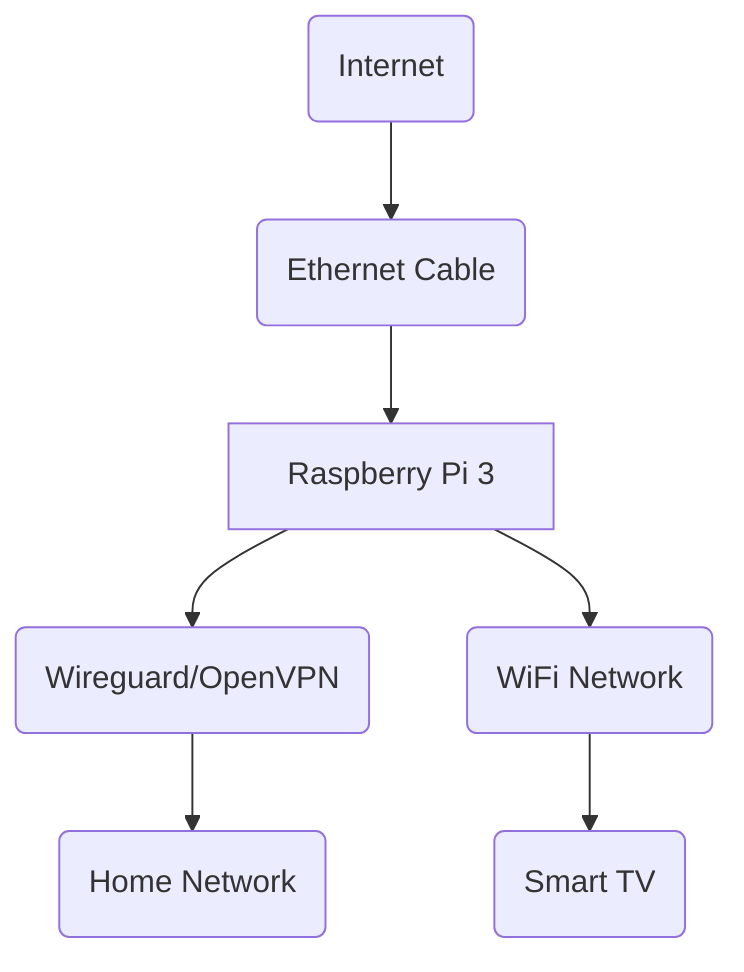

# VPNflix

    
    
    
    

This script configures a Raspberry Pi to function as a Wi-Fi access point with VPN functionality.

Requirements:
* Raspberry Pi 3
* An SD card with Raspbian/Debian installed on it
* An ethernet cable that is used to connect the Raspberry Pi to the internet
* An existing VPN configuration file that is used to connect to the desired VPN server and therefore route all traffic through it

## What it does

1. Installs the necessary packages to configure the Raspberry Pi as a Wi-Fi access point
2. Configures the Raspberry Pi as a Wi-Fi access point and sets up a DHCP server
3. Installs the necessary packages to configure the Raspberry Pi as a VPN client
4. Configures the Raspberry Pi as a VPN client and sets up a VPN tunnel to the desired VPN server
5. Configures the Raspberry Pi to route all traffic through the VPN tunnel

## How to use it
1. Clone this repository to your Raspberry Pi
2. Replace the `wg0.conf` for Wireguard or `server.conf` for OpenVPN with your own VPN configuration file
3. Adjust the network SSID and password in `hostapd.conf` to your liking
4. Run `sudo ./VPNflix.sh` and follow the instructions

tldr; It's a Raspberry Pi that you can connect to via Wi-Fi and it will route all traffic through a VPN.

